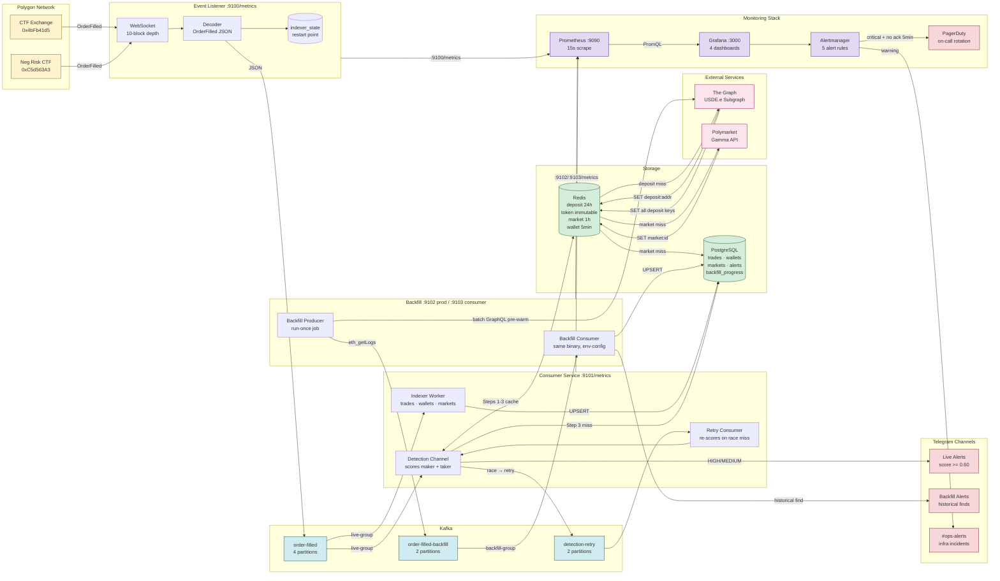
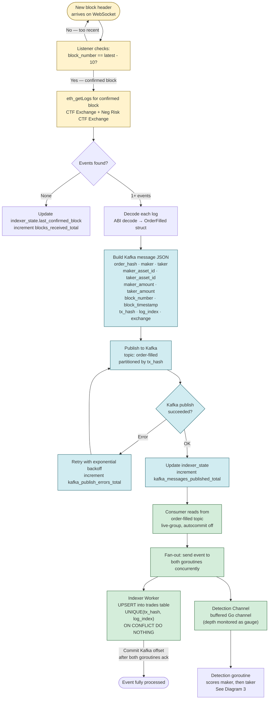
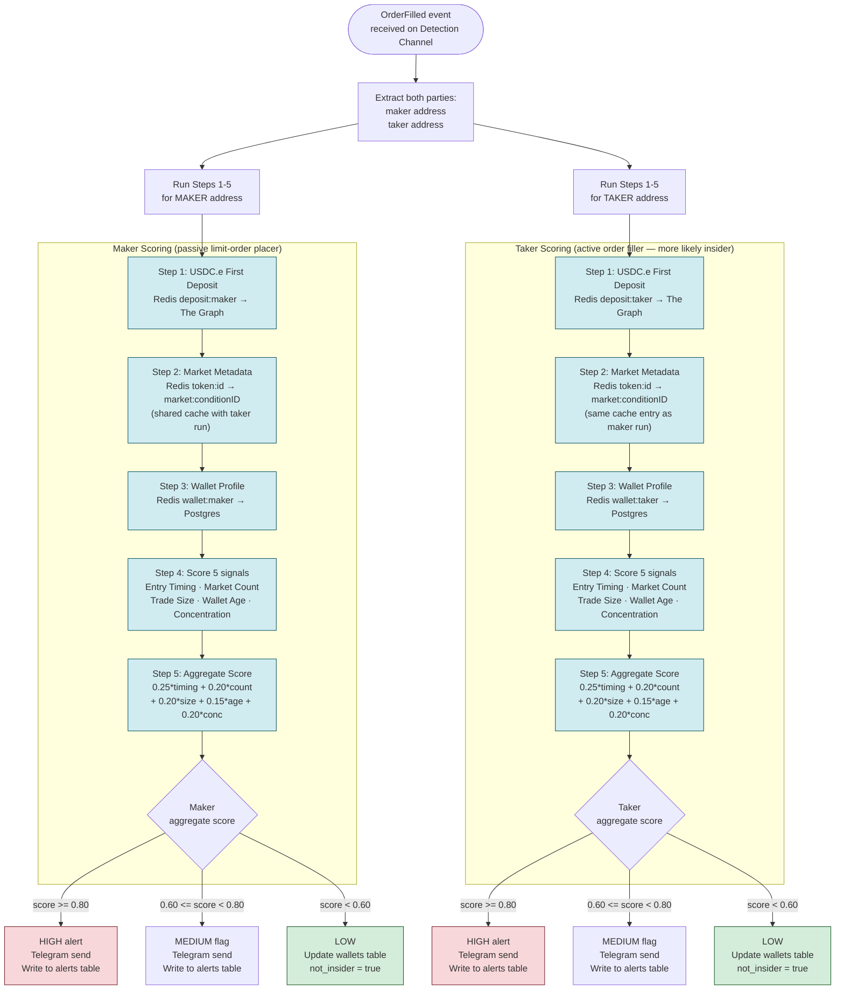
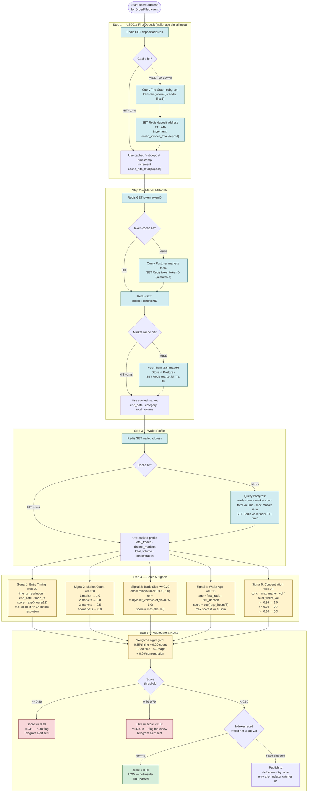
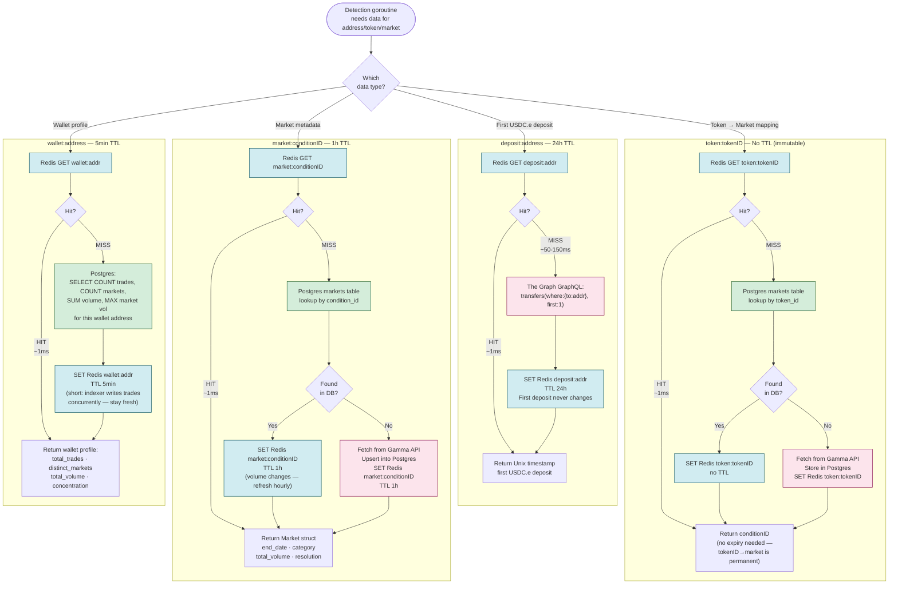
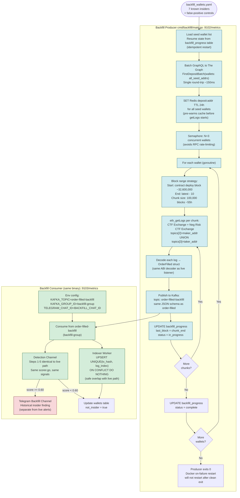
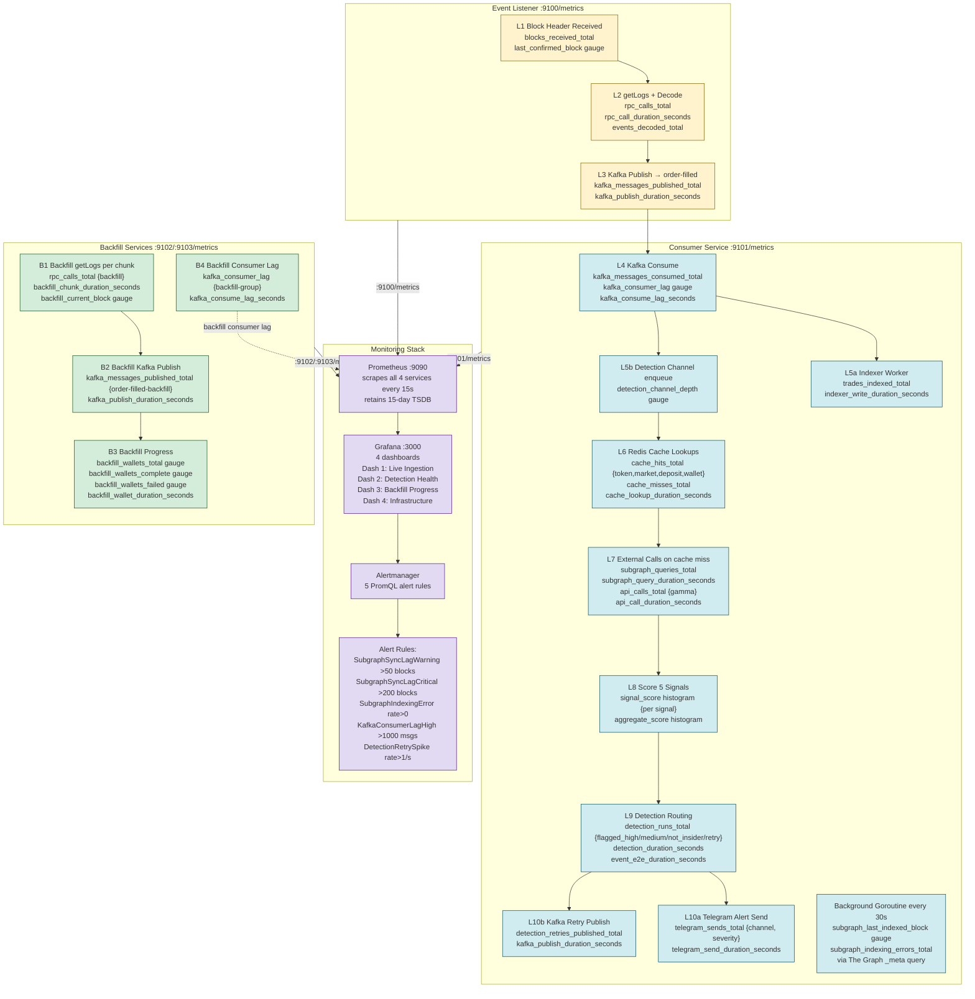
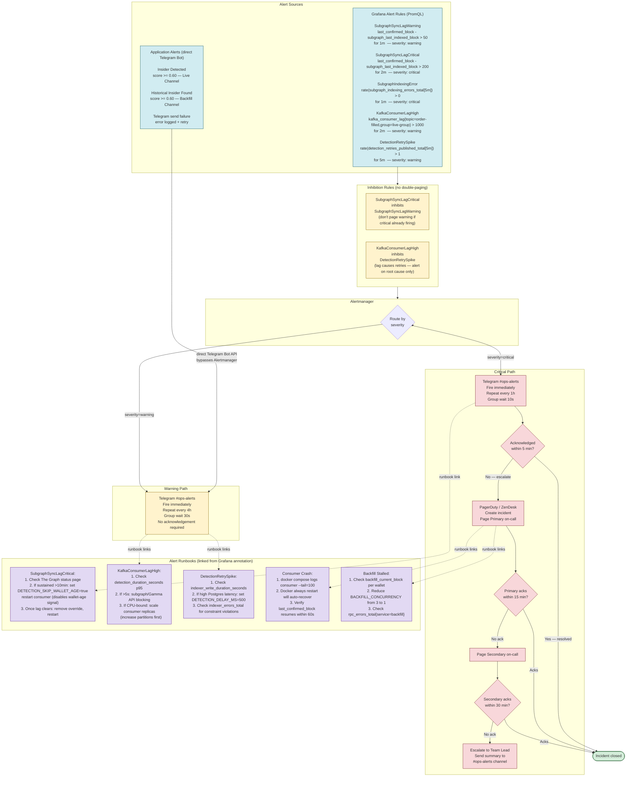

# Polymarket Insider Detection — Mermaid Diagrams

Eight detailed flow diagrams covering every major subsystem. Each diagram is self-contained and can be read independently. The diagrams progress from the high-level architecture down to individual step-by-step flows.

---

## Diagram 1 — End-to-End System Architecture

Shows every component in the system and how they connect at a high level. Use this as the entry-point map when orienting to the codebase.

---

## Diagram 2 — Live Event Path: Block to Detection

Traces a single `OrderFilled` event from Polygon block arrival through Kafka to the Consumer, showing the exact handoff between the Indexer Worker and the Detection Channel.

---

## Diagram 3 — Detection Algorithm: Dual Maker/Taker Scoring

Every `OrderFilled` event is scored twice — once for `maker`, once for `taker`. Each run is fully independent. Steps 1–5 run identically for both addresses; only the market metadata cache (Step 2) is shared between the two runs.

---

## Diagram 4 — Detection Steps 1–5: Signal Detail

Step-by-step flow within a single address scoring run (same logic for both maker and taker). Shows every cache hit/miss path, the 5 signal formulas, and the final threshold routing with retry logic.

---

## Diagram 5 — Redis Cache Read-Through Pattern

How the four Redis key types work. Each key type has a different TTL strategy and a different fallback chain when the cache misses.

---

## Diagram 6 — Historical Backfill Pipeline

The backfill is a run-once producer job plus a long-running consumer (same binary as live, different env config). It pre-warms Redis at startup, then feeds historical `OrderFilled` events through the same detection logic as the live path.

---

## Diagram 7 — Telemetry: Metrics Collection Across All Services

Every stage of the event lifecycle emits structured Prometheus metrics. This diagram shows the 10 instrumented stages (L1–L10) from block arrival through detection to alerting, and the separate backfill path stages (B1–B3).

---

## Diagram 8 — Alert Escalation Chain

Two alert sources (Grafana infrastructure alerts and application Telegram alerts) are routed through a tiered escalation chain with inhibition rules and on-call rotation.

---

## Quick Reference: Diagram Index

| # | Diagram | Key Question Answered |
|---|---------|----------------------|
| 1 | End-to-End System Architecture | What are all the components and how do they connect? |
| 2 | Live Event Path: Block to Detection | How does one `OrderFilled` event flow from Polygon to the detection goroutine? |
| 3 | Detection Algorithm: Dual Maker/Taker Scoring | Why are both maker and taker scored, and what are the outcomes? |
| 4 | Detection Steps 1–5: Signal Detail | What happens inside a single address scoring run, step by step? |
| 5 | Redis Cache Read-Through Pattern | How does each of the 4 Redis key types work with its fallback chain? |
| 6 | Historical Backfill Pipeline | How does the backfill producer seed Redis and feed the same consumer? |
| 7 | Telemetry: Metrics Collection | What is instrumented at each stage and how does it reach Grafana? |
| 8 | Alert Escalation Chain | How does a PromQL threshold turn into a PagerDuty page? |
